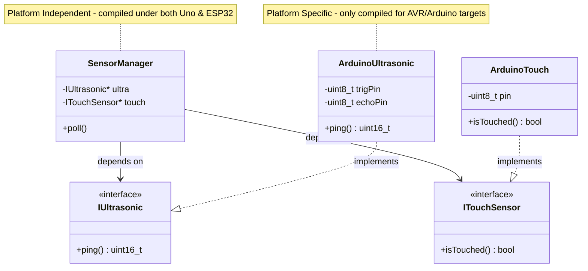

# Software Design Document: TinyCompanion (Version 1.0)

**Project Name:** TinyCompanion  
**Repository:** https://github.com/Jalu-Er/TinyCompanion  
**Author:** Senior Embedded Software Architect / Tech Lead  
**Target Architecture:** ATmega328P (Arduino Uno R3)  
**Future Migrations:** ESP32, multi-core RTOS systems  
**Framework:** Arduino Core (as HAL implementation details only)  
**Development Tooling:** VS Code OSS & PlatformIO  

---

## 1. Project Vision

The **TinyCompanion** is a responsive, emotionally expressive desktop entity designed to live alongside a laptop. Version 1 focus is **strictly behavioral and visual**, utilizing an OLED display for procedural eye expressions, a TM1637 display for system diagnostics/time, an RGB LED for emotional aura, and a passive buzzer for melodic feedback. 

Unlike standard "sensor-demo" projects, this architecture employs a formal, production-grade software design. It enforces a strict **Separation of Concerns (SoC)**, decoupling the application domain (personality, emotions, behavior state machines) from the hardware peripherals through an abstract **Hardware Abstraction Layer (HAL)**. 

### Core V1 Goals:
*   **Zero Dynamic Allocations:** Tailored for the ATmega328P's 2 KB RAM limit.
*   **Platform Independence:** Business logic is compilation-isolated from microcontroller registers and the Arduino framework.
*   **Non-Blocking Scheduling:** Multi-rate execution using a cooperative tick-based runner, completely avoiding `delay()`.
*   **ESP32 & Actuator Ready:** Simple plug-and-play HAL swaps to migrate to ESP32 or introduce servo motors in Version 2.

---

## 2. Functional Requirements

*   **FR-1: Emotional Eye Rendering:** The system must render smooth, 30 FPS procedural eye animations on a 128x64 SH1106 OLED (e.g., Happy, Sad, Mad, Bored, Scared, Sleeping).
*   **FR-2: Environment Sensing (Non-Blocking):**
    *   **FR-2.1:** Detect presence and proximity of a user within 2cm - 100cm using the HC-SR04 ultrasonic sensor.
    *   **FR-2.2:** Detect direct touch interaction using the TTP223 capacitive touch sensor.
    *   **FR-2.3:** Monitor ambient light level changes using an LDR module to sense sleep transitions.
*   **FR-3: Time Synchronisation:** The system must track time-of-day using the DS1307 RTC to manage daily routines (e.g., sleeping at night, waking up, active hours).
*   **FR-4: Audio Feedback:** Generate emotional chirp melodies via a passive buzzer using non-blocking frequency sweeps.
*   **FR-5: Emotional Aura:** Control an RGB LED to project color-coded emotional states (e.g., Red for angry, Blue for sad, Orange/Yellow for happy, Purple for scared, cyan breathing for sleeping).
*   **FR-6: Status Display:** Drive a TM1637 4-digit display to show supplementary data (e.g., current time, energy level, or system error codes).

---

## 3. Non-Functional Requirements

*   **NFR-1 (Portability):** No vendor-specific SDK calls (e.g., `digitalWrite()`, `Wire.begin()`) or third-party device libraries shall appear inside the logic engines. All must be mediated by pure C++ abstract interfaces (HAL).
*   **NFR-2 (Memory Footprint):**
    *   **SRAM Budget:** Maximum SRAM usage must not exceed 1.5 KB (75% of ATmega328P's RAM) to prevent stack collisions.
    *   **Flash Budget:** Must fit within 28 KB of Flash (allowing 4 KB bootloader space). Constant assets, like standard text or configuration settings, must reside in Flash using the `PROGMEM` utility.
*   **NFR-3 (Execution Scheduling):**
    *   The main loop cycle must run deterministically.
    *   High-frequency tasks (display rendering, audio tick) must not be starved by slow-frequency tasks (ultrasonic ping, RTC time read).
*   **NFR-4 (Cohesion and Coupling):** 
    *   Coupling index between modules must be kept low through an **Event-Driven Architecture**.
    *   No engine shall directly call another engine's private internals; interaction occurs via state transitions and events.

---

## 4. High-Level Architecture

The system utilizes an **onion-layered architecture** combined with a **dependency inversion scheme**. The core logic depends only on interfaces, and the platform-specific implementations depend on those same interfaces.

```
       +-------------------------------------------------+
       |                  Presentation                   |
       |  (EyeRenderer, AudioManager, AuraManager)       |
       +-----------------------+-------------------------+
                               |
                               v
       +-------------------------------------------------+
       |                  Engine Layer                   |
       |  (StateMachine, EmotionEngine, Personality)     |
       +-----------------------+-------------------------+
                               |
                               v
       +-------------------------------------------------+
       |              Infrastructure Layer               |
       |            (EventQueue, TimeManager)            |
       +-----------------------+-------------------------+
                               |
                               v
       +-------------------------------------------------+
       |           Hardware Abstraction (HAL)            |
       |      (IUltrasonic, ITouch, IDisplay, IRtc)      |
       +-----------------------+-------------------------+
                               ^
                               | (Implements)
       +-----------------------+-------------------------+
       |             Platform Adapter Layer              |
       |       (ArduinoUnoHAL, SH1106_Wire_Driver)       |
       +-------------------------------------------------+
```

---

## 5. Layer Architecture

1.  **Application Entry & Dispatcher (Main):** Initializes the system registry, sets up the concrete hardware objects, injects dependencies, and controls the main tick loop.
2.  **Engine Layer (Domain Logic):**
    *   **StateMachine (FSM):** Translates events into high-level behavioral states (e.g., Sleeping, Idle, Scared).
    *   **EmotionEngine:** Updates emotional coordinates (Valence/Arousal) based on input events.
    *   **PersonalityEngine:** Alters state transition thresholds and emotional decay rates.
    *   **AnimationEngine:** Calculates procedural coordinates of the eyes.
3.  **Infrastructure Layer:**
    *   **EventQueue:** Standard fixed-size ring buffer for queuing and dispatching event payloads safely without heap fragmentation.
    *   **TimeManager:** Translates raw clock ticks or RTC readings into time-of-day structs.
4.  **Hardware Abstraction Layer (HAL):** Pure virtual interface classes defining operations for sensors, displays, memory, and general I/O.
5.  **Driver Adapters:** Concrete classes implementing the HAL interfaces, wrapped around platform SDK libraries (like Arduino Core, Wire, and SPI).

---

## 6. Module Diagram

```mermaid
graph TD
    subgraph Core Logic [Platform-Independent Core]
        MainLoop[Main Tick Scheduler]
        EVQ[Event Queue]
        FSM[State Machine]
        EE[Emotion Engine]
        PE[Personality Engine]
        AE[Animation Engine]
        
        %% Managers
        SM[Sensor Manager]
        DM[Display Manager]
        AM[Audio Manager]
        LM[LED Manager]
    end

    subgraph HAL [Hardware Abstraction Layer]
        IUltra[IUltrasonic]
        ITouch[ITouchSensor]
        ILight[ILightSensor]
        IRtc[IRtcClock]
        IBuzz[IBuzzer]
        ILed[ILedAura]
        IOled[IOledDisplay]
        ITm[ITm1637]
    end

    subgraph Drivers [Concrete Platform Drivers - Arduino Uno]
        DrvUltra[ArduinoUltrasonic]
        DrvTouch[ArduinoTouch]
        DrvLight[ArduinoAnalogLight]
        DrvRtc[ArduinoDS1307]
        DrvBuzz[ArduinoToneBuzzer]
        DrvLed[ArduinoPwmRGB]
        DrvOled[SH1106_Oled_Driver]
        DrvTm[TM1637_Segment_Driver]
    end

    %% Wiring Core to HAL
    SM --> IUltra
    SM --> ITouch
    SM --> ILight
    
    DM --> IOled
    DM --> ITm
    
    AM --> IBuzz
    LM --> ILed
    
    MainLoop --> EVQ
    EVQ --> FSM
    FSM --> EE
    EE --> PE
    EE --> AE
    
    AE --> DM
    
    %% Wiring HAL to Drivers
    IUltra <|-- DrvUltra
    ITouch <|-- DrvTouch
    ILight <|-- DrvLight
    IRtc <|-- DrvRtc
    IBuzz <|-- DrvBuzz
    ILed <|-- DrvLed
    IOled <|-- DrvOled
    ITm <|-- DrvTm
```

---

## 7. Dependency Diagram

To ensure strict porting capacity, dependencies point **inward** toward the interfaces. No core logic classes include `<Arduino.h>`.



---

## 8. Folder Structure

The project conforms to the standard PlatformIO layout, structured to isolate components cleanly:

```text
TinyCompanion/
├── platformio.ini                 # PlatformIO project configuration
├── docs/
│   └── SOFTWARE_DESIGN_DOCUMENT.md # Architectural design details
├── include/                       # Global project definitions and interfaces
│   ├── Config.h                   # Pin mapping and calibration parameters
│   └── HAL/                       # Core Hardware Abstraction Interfaces
│       ├── IUltrasonic.h
│       ├── ITouchSensor.h
│       ├── ILightSensor.h
│       ├── IRtcClock.h
│       ├── IBuzzer.h
│       ├── ILedAura.h
│       ├── IOledDisplay.h
│       └── ITm1637.h
├── lib/                           # Core Business Logic (Unit-testable on PC)
│   ├── Common/
│   │   └── TimeTypes.h            # Custom datetime definitions
│   ├── EventSystem/
│   │   ├── Event.h
│   │   └── EventQueue.h
│   ├── PersonalityEngine/
│   │   └── PersonalityEngine.h
│   ├── EmotionEngine/
│   │   └── EmotionEngine.h
│   ├── StateMachine/
│   │   ├── State.h
│   │   └── StateMachine.h
│   └── AnimationEngine/
│       ├── AnimationEngine.h
│       └── EyeRenderer.h
└── src/                           # Platform dependencies and application composition
    ├── main.cpp                   # Startup configuration and scheduling loops
    ├── adapters/                  # Concrete implementation of HAL for Uno
    │   ├── ArduinoUltrasonic.h
    │   ├── ArduinoUltrasonic.cpp
    │   ├── ArduinoTouch.h
    │   ├── ArduinoTouch.cpp
    │   ├── ArduinoLightSensor.h
    │   ├── ArduinoLightSensor.cpp
    │   ├── ArduinoRtc.h
    │   ├── ArduinoRtc.cpp
    │   ├── ArduinoBuzzer.h
    │   ├── ArduinoBuzzer.cpp
    │   ├── ArduinoLed.h
    │   ├── ArduinoLed.cpp
    │   ├── ArduinoOledSH1106.h
    │   └── ArduinoOledSH1106.cpp
    └── managers/                  # High-level logic orchestrating HAL modules
        ├── SensorManager.h
        ├── SensorManager.cpp
        ├── DisplayManager.h
        ├── DisplayManager.cpp
        ├── AudioManager.h
        ├── AudioManager.cpp
        ├── LedManager.h
        └── LedManager.cpp
```

---

## 9. Class Responsibilities

| Class Name | Primary Responsibility | Collaborators |
| :--- | :--- | :--- |
| `EventQueue` | Buffers incoming system events using a thread-safe / interrupt-safe static ring-buffer. | `Event` |
| `SensorManager` | Periodically polls all sensors (Touch, Ultrasonic, Light), debounces raw values, and writes processed results to `EventQueue`. | `IUltrasonic`, `ITouchSensor`, `ILightSensor`, `EventQueue` |
| `StateMachine` | Drives the overall system state (Sleeping, Idle, Alert, Interaction) based on incoming events. | `EventQueue`, `State`, `EmotionEngine` |
| `EmotionEngine` | Updates Valence and Arousal variables in real-time, decaying values back to baseline and mapping coordinates to emotional categories. | `PersonalityEngine` |
| `PersonalityEngine` | Stores fixed characteristics (e.g., Boldness, Excitability) that serve as coefficient weights for emotional transitions. | None |
| `AnimationEngine` | Computes interpolation steps (eye size, pupil offsets, eyelid blink frequencies) based on current emotion and state. | `EyeRenderer`, `DisplayManager` |
| `EyeRenderer` | Draws procedural geometric shapes representing eyelids and pupils onto the physical screen buffer. | `IOledDisplay` |
| `DisplayManager` | Coordinates writing eye shapes onto the OLED and peripheral status text/data onto the TM1637. | `IOledDisplay`, `ITm1637`, `IRtcClock` |
| `AudioManager` | Triggers emotional synthesizer tones (non-blocking) based on active State / Emotion. | `IBuzzer` |
| `LedManager` | Calculates colors and breathing/pulse patterns for the RGB LED according to current emotion variables. | `ILedAura` |

---

## 10. Hardware Abstraction Layer (HAL)

To guarantee portability, HAL interfaces must contain absolutely no Arduino framework types. They are pure C++ contracts.

### Ultrasonic Sensor Interface (`IUltrasonic.h`)
```cpp
#pragma once
#include <stdint.h>

class IUltrasonic {
public:
    virtual ~IUltrasonic() {}
    
    /**
     * @brief Measures current distance to target in centimeters.
     * @return Distance in cm, or 0xFFFF if out of range / sensor timeout.
     */
    virtual uint16_t getDistanceCm() = 0;
};
```

### Touch Sensor Interface (`ITouchSensor.h`)
```cpp
#pragma once

class ITouchSensor {
public:
    virtual ~ITouchSensor() {}
    
    /**
     * @brief Checks if touch is currently active.
     * @return true if touched, false otherwise.
     */
    virtual bool isTouched() = 0;
};
```

### Display Interface (`IOledDisplay.h`)
```cpp
#pragma once
#include <stdint.h>

class IOledDisplay {
public:
    virtual ~IOledDisplay() {}
    
    virtual void begin() = 0;
    virtual void clear() = 0;
    virtual void display() = 0;
    
    virtual void drawCircle(int16_t x0, int16_t y0, int16_t r, uint8_t color) = 0;
    virtual void fillCircle(int16_t x0, int16_t y0, int16_t r, uint8_t color) = 0;
    virtual void drawRect(int16_t x, int16_t y, int16_t w, int16_t h, uint8_t color) = 0;
    virtual void fillRect(int16_t x, int16_t y, int16_t w, int16_t h, uint8_t color) = 0;
    virtual void drawLine(int16_t x0, int16_t y0, int16_t x1, int16_t y1, uint8_t color) = 0;
};
```

---

## 11. Event System

The Event System operates as a decoupled publisher-subscriber broker using a static circular buffer. This prevents heap allocation overhead and reduces standard code dependencies.

### Event Definition (`Event.h`)
```cpp
#pragma once
#include <stdint.h>

enum class EventType : uint8_t {
    NONE = 0,
    TOUCH_TRIGGERED,
    TOUCH_RELEASED,
    OBJECT_DETECTED_NEAR,  // Proximity <= 15cm
    OBJECT_DETECTED_FAR,   // Proximity > 15cm && <= 80cm
    OBJECT_LOST,           // Proximity > 80cm
    LIGHT_LEVEL_DARK,      // LDR below Dark Threshold
    LIGHT_LEVEL_BRIGHT,    // LDR above Dark Threshold
    TICK_MINUTE,           // Triggered by RTC once per minute
    EMOTION_CHANGED,
    STATE_CHANGED
};

struct Event {
    EventType type;
    union {
        uint16_t rawValue; // Optional raw data (distance, light level, etc.)
        struct {
            uint8_t val1;
            uint8_t val2;
        } bytes;
    } data;
};
```

### Event Queue Interface (`EventQueue.h`)
```cpp
#pragma once
#include "Event.h"

class EventQueue {
private:
    static constexpr uint8_t QUEUE_SIZE = 8; // Small buffer suited for AVR SRAM
    Event queue[QUEUE_SIZE];
    uint8_t head = 0;
    uint8_t tail = 0;
    uint8_t count = 0;

public:
    EventQueue() = default;

    bool enqueue(const Event& event) {
        if (count >= QUEUE_SIZE) {
            return false; // Queue full, drop event or handle overflow
        }
        queue[tail] = event;
        tail = (tail + 1) % QUEUE_SIZE;
        count++;
        return true;
    }

    bool dequeue(Event& outEvent) {
        if (count == 0) {
            return false; // Empty
        }
        outEvent = queue[head];
        head = (head + 1) % QUEUE_SIZE;
        count--;
        return true;
    }

    bool isEmpty() const { return count == 0; }
    void clear() { head = 0; tail = 0; count = 0; }
};
```

---

## 12. State Machine

The high-level state machine directs overall companion actions. Transitions are driven exclusively by events processed from the `EventQueue`.

```
                    +------------------------------------+
                    |              SLEEPING              |
                    +-----------------+------------------+
                                      |
                     LIGHT_LEVEL_BRIGHT (Daytime)
                                      |
                                      v
                    +------------------------------------+
                    |             WAKING_UP              |
                    +-----------------+------------------+
                                      |
                           Animation Complete
                                      |
                                      v
+------------------->------------------------------------+<-------------------+
|                   |                IDLE                |                   |
|                   +--------+------------------+--------+                   |
|                            |                  |                            |
|                 OBJECT_DETECTED_NEAR   TOUCH_TRIGGERED                     |
|                            |                  |                            |
|                            v                  v                            |
|                   +--------v--------+   +-----v--------------+             |
|                   |   SCARED_ALERT  |   |    INTERACTIVE     |             |
|                   +--------+--------+   +-----+--------------+             |
|                            |                  |                            |
|                 OBJECT_DETECTED_FAR     TOUCH_RELEASED / Timeout           |
|                            |                  |                            |
+-------------------<--------+------------------+-------->-------------------+
                                      |
                              LIGHT_LEVEL_DARK
                                      |
                                      v
                    +-----------------+------------------+
                    |              SLEEPING              |
                    +------------------------------------+
```

### State Implementations & Transitions:
*   **SLEEPING:** Lowest activity. The eyes are drawn as horizontal lines (`__  __`). Periodic breathing animations occur. RGB aura set to deep dim blue. TM1637 displays clock. Transition out when `LIGHT_LEVEL_BRIGHT` is received.
*   **WAKING_UP:** Transition state. Eye animation: blinking cycles and pupil adjustment. The buzzer plays a soft yawning chime.
*   **IDLE:** Normal routine state. Eyes perform random saccades (fast eye movements) and periodic blinking. Aura: green/cyan.
*   **INTERACTIVE:** Triggered by `TOUCH_TRIGGERED`. Companion is happy. Eyes squish upwards (`^^  ^^`). Aura breathes yellow. Buzzer plays high pitch chirps.
*   **SCARED_ALERT:** Triggered by rapid approach (`OBJECT_DETECTED_NEAR`). Eyes expand wide (drawn as massive circles with tiny pupils). Aura flashes red. Buzzer emits a rapid warning beep.

---

## 13. Personality Engine

The **Personality Engine** alters behavior parameters to make the pet unique. By utilizing config structs, a single firmware compilation can render a "Shy Pet", a "Hyperactive Pet", or a "Grumpy Pet".

```cpp
struct PersonalityProfile {
    uint8_t excitability;  // How fast Arousal grows with events [0 - 100]
    uint8_t friendliness;  // How fast Valence grows with touch [0 - 100]
    uint8_t recoveryRate;  // How fast emotions return to baseline [0 - 100]
    uint8_t fearThreshold; // Lower value = more easily scared
};
```

*   **Shy Pet:** High Excitability, low Friendliness, low Fear Threshold. Easily startled by ultrasonic detection and stays scared longer (low recovery rate).
*   **Hyperactive Pet:** High Excitability, high recovery rate, high Friendliness. Recovers from being scared quickly, and is constantly seeking active animations.

---

## 14. Emotion Engine

Emotions are modeled dynamically on a **2D Valence-Arousal plane** (Russell's Circumplex Model).

```
                 Arousal (Energy / Excitement)
                             ^
                             |
         SCARED / ALERT      |      HAPPY / EXCITED
                             |
- Valence <------------------+------------------> + Valence (Pleasure)
(Unpleasant)                 |                    (Pleasant)
                             |
            SAD              |       BORED / SLEEPY
                             |
                             v
```

### Decay and Logic Loop:
Every 100ms, the `EmotionEngine` ticks:
1.  **Decay:** Valence and Arousal decay slowly toward $(0, 0)$ based on `PersonalityProfile::recoveryRate`.
2.  **Mapping:** The resulting 2D coordinates are mapped to discrete states for display:

$$\text{Emotion} = \begin{cases} 
\text{Scared} & \text{if } A > 50 \text{ and } V < -30 \\
\text{Happy} & \text{if } A > 20 \text{ and } V > 30 \\
\text{Sad} & \text{if } A < -20 \text{ and } V < -30 \\
\text{Bored} & \text{if } A < -40 \text{ and } -30 \le V \le 30 \\
\text{Neutral} & \text{otherwise}
\end{cases}$$

---

## 15. Animation Engine

Animations must not block execution. Therefore, the system utilizes **procedural eye parameter interpolation** instead of running pre-computed frames from flash memory (which saves huge amounts of storage).

```cpp
struct EyeParameters {
    int8_t leftPupilX;  // Offset from center X
    int8_t leftPupilY;  // Offset from center Y
    int8_t rightPupilX;
    int8_t rightPupilY;
    uint8_t eyeSize;    // Diameter
    uint8_t upperLid;   // Eyelid cover percentage (0: open, 100: fully shut)
    uint8_t lowerLid;   
    int8_t eyeRotation; // Angle in degrees (used for anger tilting)
};
```

The `AnimationEngine` holds a `currentEyeState` and a `targetEyeState`. Every animation frame (30ms), it interpolates parameters using a lightweight Fixed-Point Linear Interpolation (`lerp`) or simple easing math.

```cpp
void updateInterpolation(uint8_t factor) {
    current.leftPupilX  += ((target.leftPupilX  - current.leftPupilX)  * factor) >> 4;
    current.leftPupilY  += ((target.leftPupilY  - current.leftPupilY)  * factor) >> 4;
    current.upperLid    += ((target.upperLid    - current.upperLid)    * factor) >> 4;
    current.lowerLid    += ((target.lowerLid    - current.lowerLid)    * factor) >> 4;
    // factor is scaled such that shifts are non-blocking integer shifts
}
```

---

## 16. Eye Rendering System

The rendering calculations map `EyeParameters` onto physical draw actions for the SH1106 display.

```
       LEFT EYE (Center: 32, 32)           RIGHT EYE (Center: 96, 32)
      +-------------------------+         +-------------------------+
      |        _________        |         |        _________        |  <-- Upper Lid Line
      |      /    ___    \      |         |      /    ___    \      |
      |     |    /   \    |     |         |     |    /   \    |     |
      |     |   |  *  |   |     |         |     |   |  *  |   |     |  <-- Pupil (fillCircle)
      |     |    \___/    |     |         |     |    \___/    |     |
      |      \ _________ /      |         |      \ _________ /      |
      |                         |         |                         |  <-- Lower Lid Line
      +-------------------------+         +-------------------------+
```

### Memory Optimization for ATmega328P:
An full 128x64 display buffer requires $128 \times 64 / 8 = 1024$ bytes of RAM. This is exactly **50% of the entire Uno memory!**
*   **Optimization 1:** The `EyeRenderer` draws shapes directly using symmetry.
*   **Optimization 2:** Eyelids are rendered by writing filled rectangles (`fillRect`) in the color of the background (Black) to clip parts of the white eye circles, simulating blinking without complex math.
*   **Optimization 3:** Text assets and debug screens are never loaded into RAM; everything goes through `F()` macros or `PROGMEM`.

---

## 17. Time System (RTC)

The `TimeManager` tracks temporal intervals. The DS1307 RTC module is polled at a slow rate (e.g., every 5 seconds) to ensure negligible I2C bus load.

```cpp
struct TimeStruct {
    uint8_t hour;
    uint8_t minute;
    uint8_t second;
    uint8_t dayOfWeek;
};
```

### Routine Coordination:
*   **Bedtime Transition:** If `hour == 22 && minute == 00`, the system dispatches `LIGHT_LEVEL_DARK` internally, enforcing sleep mode regardless of ambient LDR values (unless forced awake by physical interaction).
*   **Wake Time Transition:** If `hour == 07 && minute == 00`, the system dispatches `LIGHT_LEVEL_BRIGHT` to trigger the wake-up cycle.

---

## 18. Sensor Manager

The `SensorManager` encapsulates the non-blocking polling and conditioning of the system's inputs:

1.  **HC-SR04 Proximity Sensor:**
    *   To prevent blocking, we do *not* use `pulseIn()` (which blocks for up to 30ms).
    *   **Interrupt/Timer Implementation:** We trigger the ping manually and measure the echo time using a hardware pin change interrupt (PCI) or input capture unit. If running under Uno, we can poll using a non-blocking timestamp counter comparison.
    *   A running median filter of size 5 is applied to filter out spikes.
2.  **TTP223 Touch Sensor:**
    *   Polled every 50ms.
    *   Requires a simple debouncer to prevent false multi-triggers. Must stay high for at least 100ms to count as a hold.
3.  **LDR Light Sensor:**
    *   Analog read of pin `A0` is polled every 1 second.
    *   An exponential moving average filter is applied to prevent instantaneous light flickers from turning off the pet.
    
    $$Light_{filtered} = (AnalogRead \times 0.2) + (Light_{filtered} \times 0.8)$$

---

## 19. Display Manager

The `DisplayManager` acts as the master coordinator for outputs. It decouples the core animation from the screen layout.

*   **Refresh Strategy:**
    *   OLED (SH1106): Updated at ~30 FPS (33ms ticks).
    *   TM1637: Updated only when information changes (e.g., when the minutes register increments on the RTC or state energy is depleted) to prevent blocking the shared CPU bus.
*   **Double Buffering:** Not possible on Uno due to lack of RAM. The display buffer is modified in place and pushed to the display chip in a single block using optimized I2C routines at 400kHz.

---

## 20. Audio Manager

The passive buzzer produces sound without blocking the system loop. The `AudioManager` runs a small state machine driven by ticks:

```cpp
struct ToneStep {
    uint16_t frequencyHz;
    uint16_t durationMs;
};

// Melodies stored in flash memory
const ToneStep WAKEUP_MELODY[] PROGMEM = {
    {262, 100}, {330, 100}, {392, 100}, {523, 300}
};
```

### Dynamic Sweep Calculations:
```cpp
void AudioManager::tick(uint32_t currentMillis) {
    if (!isPlaying) return;
    
    if (currentMillis - stepStartTime >= currentStepDuration) {
        currentStepIndex++;
        if (currentStepIndex >= totalSteps) {
            buzzer->stop();
            isPlaying = false;
        } else {
            playCurrentStep();
        }
    }
}
```

---

## 21. LED Manager

The `LedManager` provides the ambient visual reinforcement (the "aura") of the pet's inner feelings:

*   **Interface Interface:** `ILedAura` sets individual $R$, $G$, $B$ channels.
*   **Breathing Effect:** Employs a sine wave look-up table stored in PROGMEM to drive intensity shifts:
    
    $$PWM_{val} = \text{brightness} \times \sin\left(\frac{t \times \pi}{Period}\right)$$

*   **Color Mapping:**
    *   *Scared:* Fast Red flashing (100ms cycles).
    *   *Happy:* Smooth breathing transition from Yellow to Orange (2000ms cycles).
    *   *Sleeping:* Very slow, dim cyan/purple pulse (4000ms cycles).

---

## 22. Data Flow

```
   [Physical World]
          │
          ▼
   ┌──────────────┐
   │ Hardware Pins│
   └──────┬───────┘
          │ (Digital / Analog / I2C Read)
          ▼
   ┌──────────────┐
   │ Drivers / HAL│
   └──────┬───────┘
          │
          ▼
   ┌──────────────┐
   │Sensor Manager│ (De-noising & Threshold Checking)
   └──────┬───────┘
          │
          ▼ (Enqueue event)
   ┌──────────────┐
   │ Event Queue  │
   └──────┬───────┘
          │
          ▼ (Dequeue event)
   ┌──────────────┐
   │State Machine │ ──(Updates)──► ┌────────────────┐
   └──────────────┘                │ Emotion Engine │
                                   └───────┬────────┘
                                           │
                                           ▼ (Pushes coordinates / profiles)
                                   ┌────────────────┐
                                   │Animation Engine│
                                   └───────┬────────┘
                                           │
                                           ▼ (Interpolates Coordinates)
                                   ┌────────────────┐
                                   │Display Manager │
                                   └───────────────┘
```

---

## 23. Main Loop Flow

The `main` file implements a lightweight, cooperative multi-tasking loop. Tasks are assigned execution periods.

```cpp
struct SystemTask {
    void (*taskFunction)();
    uint32_t periodMs;
    uint32_t lastRunMs;
};

// Scheduler array
SystemTask scheduler[] = {
    { &pollSensors,    50,  0 },  // 20 Hz
    { &updateState,   100,  0 },  // 10 Hz
    { &updateAudio,    20,  0 },  // 50 Hz
    { &renderOled,     33,  0 }   // 30 Hz (Smooth animations)
};
```

---

## 24. Startup Sequence

1.  **Hardware Inits:**
    *   Initialize I/O pins (via concrete HAL implementation).
    *   Start I2C bus at 400kHz.
    *   Run self-check on RTC and OLED.
2.  **Infrastructure Initialization:**
    *   Instantiate `EventQueue`.
    *   Inject concrete drivers into `SensorManager`, `DisplayManager`, `AudioManager`, and `LedManager`.
3.  **Self-Test Indication (POST):**
    *   Flash RGB LED Red -> Green -> Blue.
    *   Play quick sound sweep.
    *   Render startup screen (eye opening briefly).
4.  **Final Setup:**
    *   Read time from RTC to determine starting state (`SLEEPING` vs `IDLE`).
    *   Start Scheduler execution loops.

---

## 25. Update Cycle (Detailed Tick Sequence)

Below is the step-by-step processing loop for a single scheduler tick:

```cpp
void loop() {
    uint32_t currentMillis = millis(); // Kept inside main wrapper
    
    for (auto& task : scheduler) {
        if (currentMillis - task.lastRunMs >= task.periodMs) {
            task.taskFunction();
            task.lastRunMs = currentMillis;
        }
    }
}

// Example of the 100ms State update task
void updateState() {
    Event currentEvent;
    
    // 1. Process all pending events
    while (eventQueue.dequeue(currentEvent)) {
        stateMachine.processEvent(currentEvent);
        emotionEngine.processEvent(currentEvent);
    }
    
    // 2. Tick Engines
    emotionEngine.tick(100); 
    stateMachine.tick(100);
    
    // 3. Update behavior targets based on emotions
    AnimationEngine::setEmotion(emotionEngine.getCurrentEmotion());
    AudioManager::setState(stateMachine.getCurrentState());
    LedManager::setEmotion(emotionEngine.getCurrentValenceArousal());
}
```

---

## 26. Future Extension Strategy

The architecture was intentionally structured to accommodate Version 2 expansions without causing modular disruption:

### A. ESP32 Migration (No Logic Change):
*   Create new platform drivers under `src/adapters/` (e.g. `Esp32Oled.cpp`, `Esp32Ultrasonic.cpp`).
*   Recompile using the same files inside the `lib/` directory.
*   *Bonus:* FreeRTOS can be introduced by creating separate tasks wrapping the main schedulers, providing clean multi-core execution.

### B. Introducing Actuators (SG90 Servo - Head Tilt/Pan):
*   Add `IServo.h` to `include/HAL/` with methods `setAngle(uint8_t angle)`.
*   Create a `ServoManager` in the application layer.
*   Extend `AnimationEngine`'s output. The engine will not only calculate `EyeParameters` or servo values but coordinate them cleanly.

### C. Advanced I2C Sensors (VL53L0X & MPU6050):
*   Replace standard ultrasonic and sound sensors with new concrete implementation adapters.
*   Because the `SensorManager` filters hardware details, it simply reads the new driver inputs, maps them to standard events (`OBJECT_DETECTED_NEAR`), and puts them in the queue. The state machine remains unaware of the physical sensor change.

### D. WiFi / Web Connection (ESP32 Exclusive):
*   Create a `NetworkManager` module.
*   This module can push web-triggered actions (like "Feed pet remotely") onto the `EventQueue` via a custom event type `WIFI_COMMAND_RECEIVED`. The State Machine handles it like a physical touch input.

---
