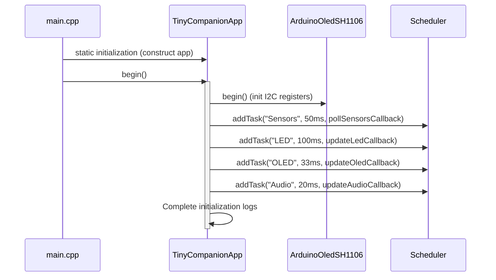

# Application Core and Cooperative Scheduler Architecture

This document describes the structure, lifecycles, dependencies flow, and timing logic of the **TinyCompanion** application core.

---

## 1. Dependency Direction and Composition Root

To maintain code portability and keep logic decoupled, we enforce the **Dependency Inversion Principle**. Dependencies point strictly downward from concrete implementations toward generic abstractions. No business logic in the `lib/` directory references concrete pins or Arduino libraries.

```
       [ TinyCompanionApp (Composition Root) ]
                         │
        ┌────────────────┴────────────────┐
        ▼                                 ▼
   [ Managers ]                    [ Event Queue ]
  (Sensor, LED, etc.)                     │
        │                                 ▼
        │                         [ Event Type Definitions ]
        ▼                                 ▲
  [ HAL Interfaces ]                      │
 (IUltrasonic, ITouch)                    │
        ▲                                 │
        │ (Implemented by)                │
  [ Concrete Adapters ] ──────────────────┘
 (ArduinoTouch, etc.)
```

The `TinyCompanionApp` acts as the **Composition Root**. It instantiates all concrete drivers and wiring dependencies in a single global place, ensuring that other classes do not instantiate their dependencies using `new`.

---

## 2. Startup Sequence

The following sequence diagram outlines how the system initializes during the boot phase:



---

## 3. Cooperative Scheduler

Timing is managed by a lightweight, non-blocking **Cooperative Scheduler** defined in `lib/Scheduler/Scheduler.h`.

### Key Features:
*   **Static Memory Allocation:** No dynamic vectors are used. Maximum capacity is restricted statically to 8 tasks to prevent SRAM memory heap fragmentation.
*   **Rollover-Safe Comparison:** Compares intervals using subtraction: `now - lastExecutionTime >= interval`. This is safe from timer overflows occurring every 49.7 days under `millis()`.
*   **Non-Preemptive (Cooperative):** Tasks are run sequentially on a single thread. It relies on tasks returning quickly (avoiding blocking code).

### Registration Setup:
```cpp
scheduler.addTask("Sensors", 50, pollSensorsCallback); // 20 Hz
scheduler.addTask("LED", 100, updateLedCallback);     // 10 Hz
scheduler.addTask("OLED", 33, updateOledCallback);     // 30 Hz
```

---

## 4. Lifecycle & FSM Integration

1.  **Boot (Setup):** `main.cpp` calls `app.begin()`. Subsystems are configured, and periodic tasks are registered.
2.  **Tick Loop:** `main.cpp` delegates loop iterations to `app.loop()`. The scheduler evaluates task intervals and fires callbacks.
3.  **Event Flow:**
    *   The `Sensors` task polls hardware inputs and pushes semantic events (`TOUCH_PRESSED`, `USER_APPROACHING`) to the `EventQueue`.
    *   *Future Integration:* The `FSM` (State Machine) task will pop events from the queue, evaluate state rules, and transition moods (Valence/Arousal values).
    *   The `OLED` and `LED` rendering tasks read current emotional values and write them as expressions and aura colors.
