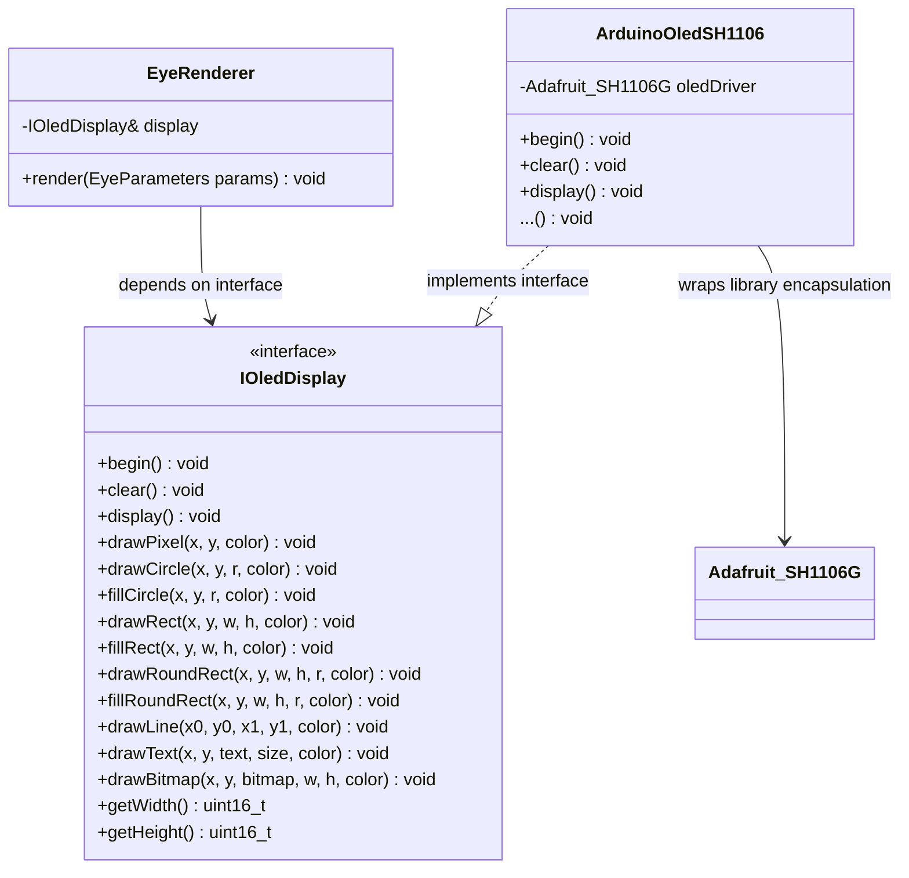

# OLED Rendering Foundation Architecture

This document describes the design, layering, and technical reasoning behind the reusable OLED rendering abstraction layer of **TinyCompanion**.

---

## 1. Abstraction Layers

To enforce the **Separation of Concerns (SoC)** and prevent **library leakage**, the display subsystem is divided into three distinct layers. Code in the logic engines (e.g., state machines, animation loops) is completely unaware of the underlying graphics driver library.

```
+-------------------------------------------------------------+
| Presentation Layer (Future EyeRenderer / Diagnostic UI)    |
+-------------------------------------------------------------+
                               │
                               ▼ (Depends strictly on interface)
+-------------------------------------------------------------+
| Hardware Abstraction Layer (HAL / IOledDisplay.h)          |
+-------------------------------------------------------------+
                               ▲
                               │ (Implemented by concrete adapter)
+-------------------------------------------------------------+
| Adapter Layer (src/adapters/ArduinoOledSH1106.h & .cpp)     |
+-------------------------------------------------------------+
                               │
                               ▼ (Invokes vendor API)
+-------------------------------------------------------------+
| Third-Party Graphic Library (Adafruit_SH110X / Adafruit_GFX)|
+-------------------------------------------------------------+
```

---

## 2. Dependency Diagram

The following class diagram demonstrates the **Dependency Inversion Principle**. Dependencies point inward toward the HAL interface, ensuring that the presentation code is decoupled from vendor libraries:



---

## 3. Ownership of Responsibilities

*   **`IOledDisplay` (HAL Interface):** Defines the strict visual contract. It exposes only pure virtual methods for drawing coordinates and primitives. It contains no state variables and does not import any library headers.
*   **`ArduinoOledSH1106` (Adapter Class):** Owns the physical display life cycle and initialization (`begin()`). It encapsulates the third-party `Adafruit_SH1106G` graphics driver object, mapping the generic HAL drawing commands to the vendor-specific GFX methods.
*   **`OledValidation` (Validation Module):** Operates as a black-box test harness. It uses the `IOledDisplay` interface directly to execute display test sequences, confirming that the adapter operates exactly as defined by the HAL contract.

---

## 4. Library Selection Rationale

During the evaluation phase, we compared **Adafruit GFX (via Adafruit_SH110X)** and **U8g2** drivers. Adafruit GFX was selected to remain as the primary driver for Version 1 on the Arduino Uno target based on the following architectural criteria:

### A. Rendering Model and CPU Load
*   **Adafruit GFX (Full Buffer Model):** Draws shapes once to a RAM buffer and pushes them to the screen via a single I2C transfer. This maintains a low CPU rendering overhead, which is critical to keeping the cooperative task runner responsive.
*   **U8g2 (Page Buffer Model):** While U8g2's page buffer mode saves 896 bytes of SRAM by using a smaller 128-byte layout window, it forces the application logic to re-run the entire draw command sequence **8 times** to output one frame (the U8g2 Picture Loop). Re-calculating complex procedurial coordinates (like circle-based eyes and easing shifts) 8 times per refresh cycle would choke the 16MHz AVR CPU, reducing frame rates and starving sensor updates.

### B. API Simplicity and Maintainability
*   The Adafruit GFX API provides a simple, direct coordinate system. Implementing custom procedural eye rendering math is straightforward and highly readable.
*   U8g2's nested loop structure makes it difficult to maintain clean separation between the state machine updates and drawing ticks, leading to higher code coupling.

### C. Evaluation Limitations Note
*   *Important:* The comparisons above are based on the structural rendering models and the CPU constraints of 8-bit AVR microcontrollers. No direct head-to-head library benchmarking (compiling U8g2 and measuring side-by-side frame times on the same hardware) has yet been performed.

---

## 5. Abstraction Improvements and Technical Debt Reduced

*   **Decoupled Dependency:** The dependency on `Adafruit_SH110X.h` is confined entirely to the files under `src/adapters/`. Presentation code does not include any Adafruit files.
*   **Future ESP32 Portability:** To port TinyCompanion to an ESP32 or a different display hardware (like SPI SSD1306 or TFT), you only need to write a new concrete class (e.g. `Esp32OledTft`) implementing `IOledDisplay`. The entire business logic and future `EyeRenderer` will require zero changes.
*   **Added Rounded Rect Primitives:** The inclusion of `drawRoundRect` and `fillRoundRect` provides an optimized, native way to render soft-edged pupil shapes without requiring costly manual circle/line combinations.
